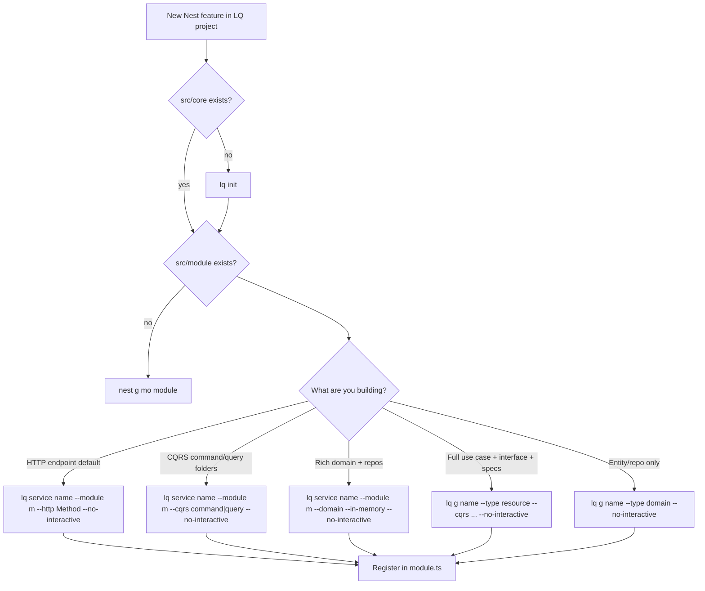

# Generator decision tree

## Choose by file count

| Approach | Files (typical) | When |
|----------|-----------------|------|
| `lq service` | 4 | CRUD/handlers, agents, fast iteration |
| `lq service --cqrs` | 4 under `usecases/` | Team uses command/query folders |
| `lq service --domain` | 4 + domain stack | Persistence + domain entity |
| `lq g --type resource` | 5–7 | Strict use-case interface + DDD layout |
| `lq g --type domain` | 5–6 | No HTTP layer yet |

## Default for AI agents

**Always start with** `lq service` unless the user explicitly asks for full DDD resource layout or domain-only scaffold.
